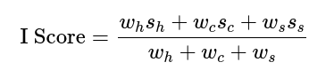
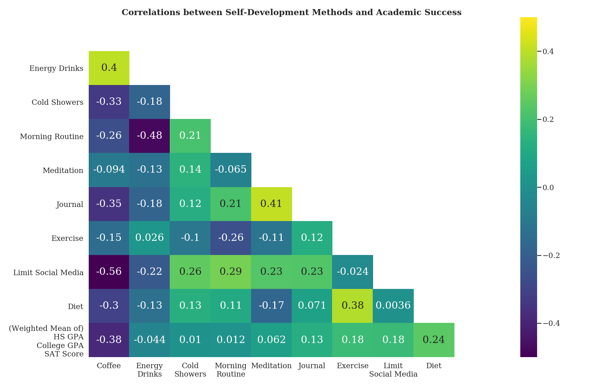
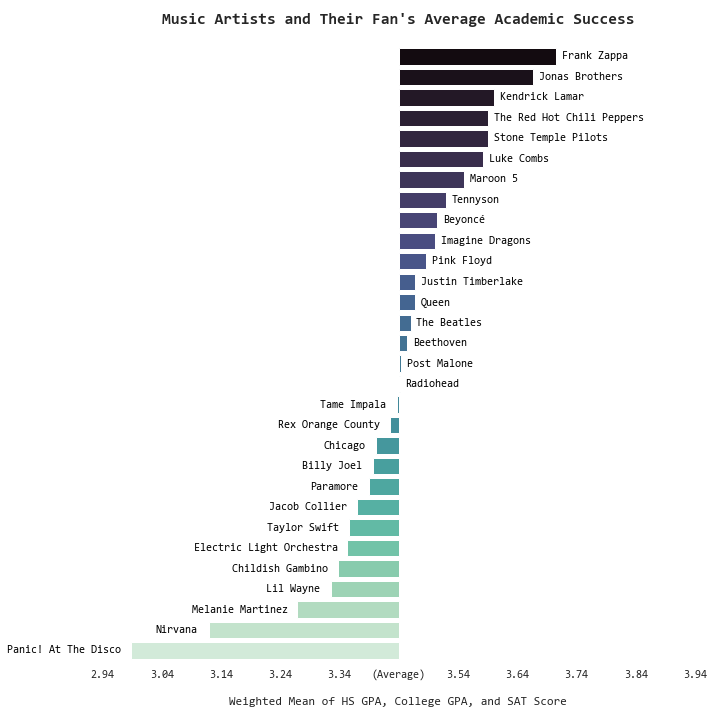

# Factors of Academic Success: Project Overview

<!--- Basic Outline Format Copied from Ken Jee -->
<!--- https://github.com/PlayingNumbers/ds_salary_proj/blob/master/README.md -->

[Web-Friendly Version of Data Analysis Notebook](https://nbviewer.jupyter.org/github/dennisfarmer/Factors-of-Academic-Success/blob/master/eda.ipynb)

- Surveyed 49 students about their school lives and personal lives
- Cleaned resulting survey data
- Analyzed survey data to locate correlations between grades and a number of personal factors to find what students should or should not be doing to increase their academic success levels
- Created webpage detailing findings, with visual plots to suppliment analysis overview

## Code Requirements

**Python Version:** 3.8

**Packages Used:** pandas, numpy, datetime, matplotlib, seaborn

## Data Source
**Google Forms Survey:** https://forms.gle/2AM9BPv56zsQCNc1A

## Data Collection
To create the dataset used for this analysis, I created a Google Forms survey that I posted on my social media accounts. Students were able to opt-in to participating by providing information about their academic grades and personal interests and traits.

- The survey was first tested on a online group-page named _**Implying Dum corps: electric boogaloo**_. This sample mainly consisted of college students who have been a member of a drum corps marching band.

- After numerous questions were added, removed, and revised, I then shared the survey on my personal Facebook, Instagram, and Snapchat accounts.

- Both of these releases each accounted for around half of the total sample size.

## Data Cleaning

- Fixed improper AM/PM selection for bedtimes and calculated average amount of sleep
- Mapped college majors into seperate categories
- Converted ACT scores into equivalent SAT scores, then created column with the highest score inbetween the two values
- Set incorrect values (score=0, etc) to NaN values instead
- Corrected order of Myers-Briggs personality type letters
- Transformed multiple response answers into seperate dummy columns
- Removed dummy columns that had a sum of less than "6" (out of 49)
- Calculated weighted average of high school GPA, college GPA, and SAT scores to allow for easier comparison of students. Formula included adjustment for missing values.



## Exploratory Data Analysis



```
                  Average I Score
Introvert ----------- 3.469
Limit Social Media -- 3.468
Diet ---------------- 3.458
Exercise ------------ 3.440
Journal ------------- 3.435
Show Up Early ------- 3.424
Meditation ---------- 3.421
Social Anxious ------ 3.403
Cold Showers -------- 3.401
Social Awkward ------ 3.401
Morning Routine ----- 3.399

[Average] ----------- 3.395

Energy Drinks ------- 3.376
Coffee -------------- 3.376
Cluttered ----------- 3.370
Depressed ----------- 3.366
Share Posts Often --- 3.333
```




- Concluded that dieting, exercise, journaling, and meditation have a positive correlation with academic success, while coffee, depression, and social media use all have a negative correlation.

- Found that while specific artists may not increase your academic abilities (correlation ≠ causation), listening to a higher number of music artists does slightly correlate [`r = 0.277`] with higher grades and test scores.

## Data Presentation

- Created a blog post on my website, outlining the project results as well as the data cleaning, transformation, and analysis process.
- Included a <a target="_blank" href="https://dennisfarmer.github.io/factors_of_academic_success/#part-iv-short-summary">short summary</a> of the analysis results to quickly summarize the conclusions I came to.

**Blog Post:** https://dennisfarmer.github.io/factors_of_academic_success/

- Wrote a personal reflection of my experience (of) working on a basic data analysis project for the first time.

**Reflection:** https://dennisfarmer.github.io/reflection_on_factors_of_academic_success_project/
